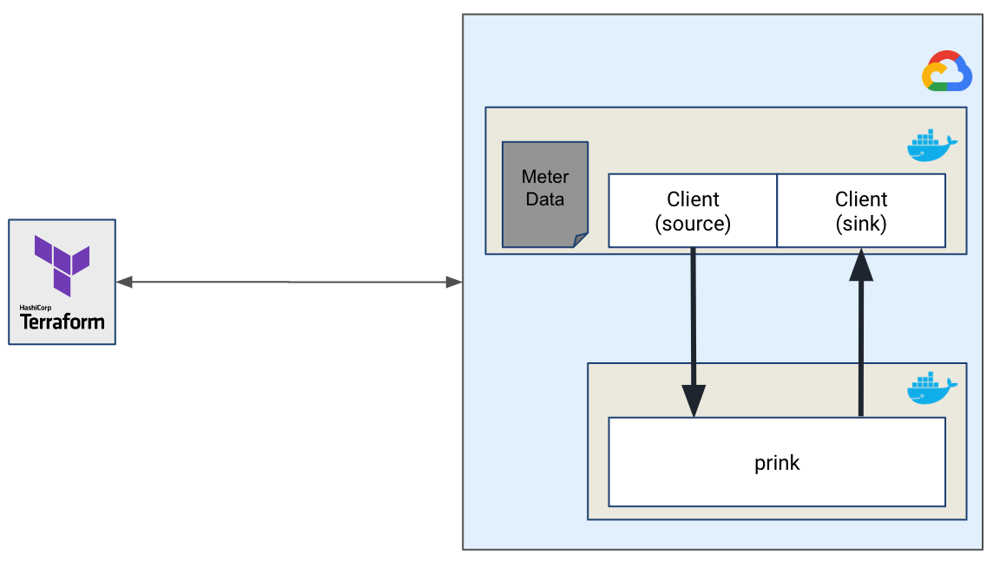
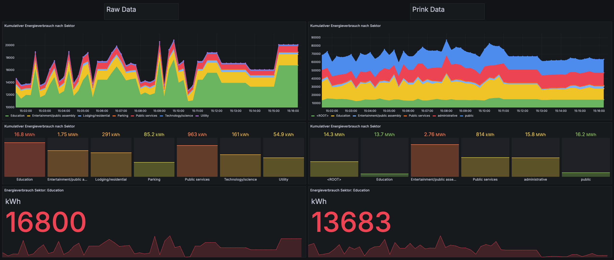

# PrinkBenchmarking


See our related publication [here](https://www.researchgate.net/publication/391866609_Prink_k_s-Anonymization_for_Streaming_Data_in_Apache_Flink).
Please cite:

```
@inproceedings{groneberg2025prink,
  author    = {Groneberg, Philip and Nuñez von Voigt, Saskia and Janke, Thomas and Loechel, Louis and Wolf, Karl and Grünewald, Elias and Pallas, Frank},
  title     = {Prink: $k_s$-Anonymization for Streaming Data in Apache Flink},
  booktitle = {Proceedings of the 20th International Conference on Availability, Reliability and Security (ARES 2025)},
  year      = {2025},
  address   = {Ghent, Belgium},
  publisher = {Springer},
  series    = {Lecture Notes in Computer Science (LNCS)},
  url       = {https://www.researchgate.net/publication/391866609_Prink_k_s-Anonymization_for_Streaming_Data_in_Apache_Flink},
}
```


### Benchmarking Framework for Prink 



## Benchmark Configuration


### SUT - Prink

### Client - Load Generator

To start the client, cd into the client directory and run the following command:

```bash
go run main.go 
```

### Grafana Dashboard
- loicated at `http://localhost:3000`



### 🪧 Demo execution
- Run the client
````
cd client
go run main.go
````
- run grafana and victoria metrics
````
docker-compose up grafana -d
docker-compose up victoriametrics -d
````

- go to `http://localhost:3000` and login with username: `admin` and pw: `grafana`
- connect a datasource: `http://victoriammetrics:8428`
- import the dashboard from `client/dashboard_references/*dashboard.json`
- enjoy the beautiful dashboard
